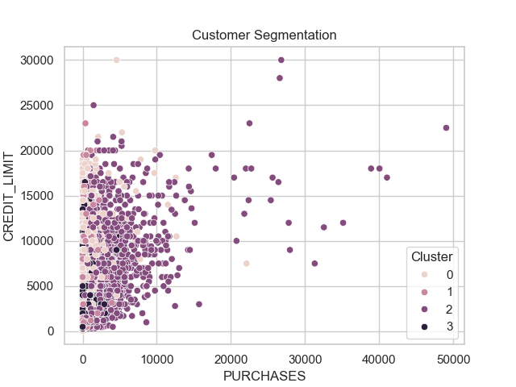
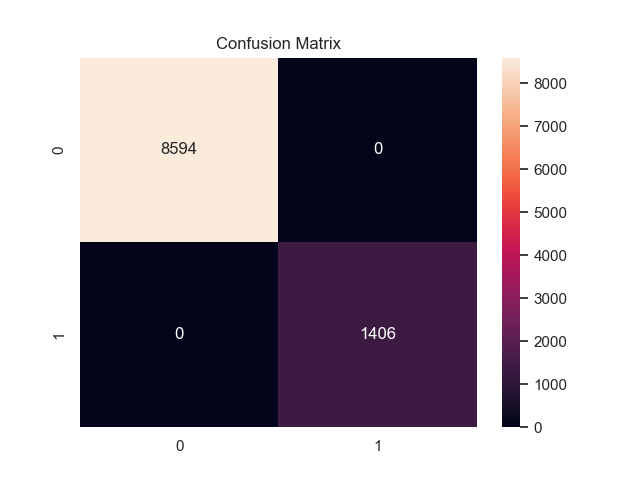
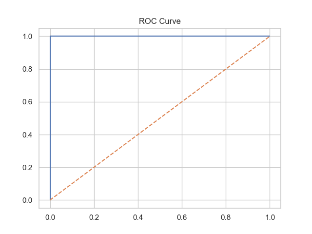
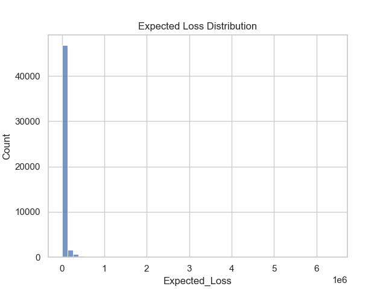
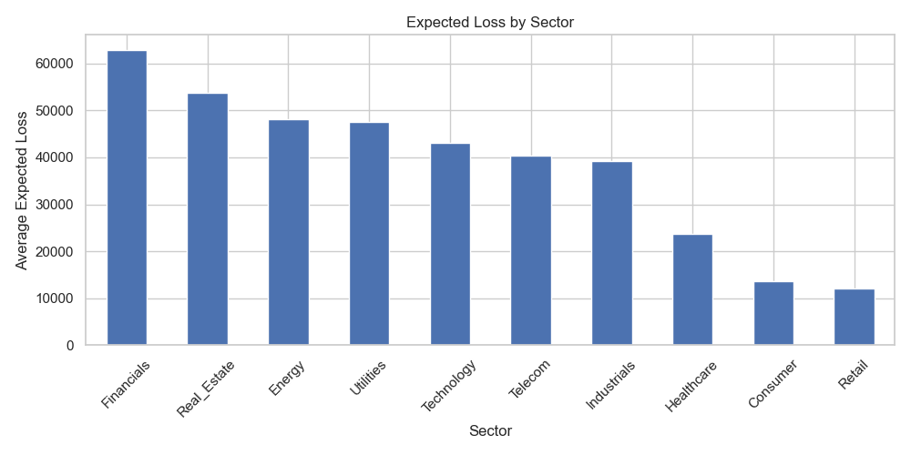

# 🚀 AI-Driven Customer Segmentation & Credit Risk Modelling

<p align="center">


</p>

---

## 🌐 Live Application

👉 **Try the app here:**  
[🚀 Open Streamlit App](https://efcwj2qwbfnurggsfk3yym.streamlit.app/)

---

## 📺 App Preview


---

## 🎯 Project Highlights

✔ End-to-end Machine Learning pipeline  
✔ Customer segmentation (unsupervised learning)  
✔ Credit risk prediction (supervised learning)  
✔ Expected Loss modelling (PD × LGD × EAD)  
✔ Real-world financial use case  

---

## 🧠 Problem Statement

Financial institutions need to understand:

- Who their customers are  
- Which customers are risky  
- How much financial loss they might face  

This project answers all three using machine learning.

---

## ⚙️ Machine Learning Pipeline

| Stage | Technique |
|------|---------|
| Data Processing | Cleaning + Scaling |
| Segmentation | KMeans Clustering |
| Risk Prediction | Random Forest |
| Evaluation | ROC-AUC, Confusion Matrix |
| Financial Modelling | Expected Loss |

---

## 📊 Visual Insights

### Customer Segmentation


### Model Performance
  


### Financial Risk
  


---

## 📈 Key Results

- Identified distinct customer segments  
- Built a model to predict loan default risk  
- Key drivers of risk:
  - Credit score
  - Leverage
  - Debt-to-equity ratio  
- Estimated Expected Loss for financial planning  

---

## 💼 Business Value

This solution helps organisations:

- Improve lending decisions  
- Identify high-risk customers early  
- Optimise customer targeting  
- Strengthen portfolio risk management  

---

## 🧪 Model Performance Summary

- Strong classification performance  
- Effective risk discrimination (ROC-AUC)  
- Financial variables drive predictions  
- Model suitable for real-world risk support  

---

## ⚖️ Responsible AI

✔ Fairness awareness  
✔ Data privacy considerations  
✔ Explainability focus  
✔ Human-in-the-loop decision making  

---

## 🛠️ Tech Stack

Python | Pandas | NumPy | Scikit-learn | Matplotlib | Seaborn | Streamlit

---

## 📂 Project Structure

```plaintext
project/
│
├── data/
├── images/
│   ├── banner.png
│   └── app_preview.png
│
├── outputs/figures/
├── notebooks/
│   └── project.ipynb
│
├── app.py
├── requirements.txt
└── README.md

🔮 Future Improvements
SHAP explainability
Model tuning
Real-time prediction system
Cloud deployment
👤 Author

Noor Saba
Aspiring Data Scientist